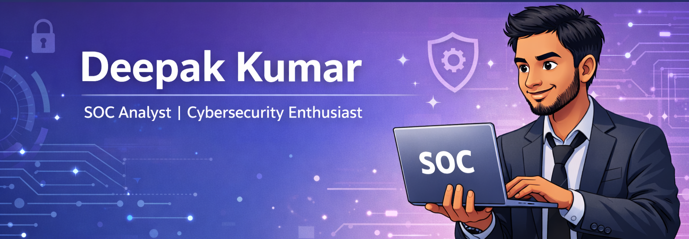

<h1 align="center">Hi, I'm Deepak 👋</h1>

   

 
---

## 👨‍💻 About Me

I am Deepak Kumar, a BCA student from GNIOT Institute of Professional Studies , Greater Noida, Uttar Pradesh. I am an aspiring SOC Analyst with a strong interest in cybersecurity, threat detection, and network security. I have hands-on experience working with Linux systems, analyzing network traffic, and monitoring security logs through home labs and practical projects. I am constantly learning and developing my skills in areas such as SOC operations, log analysis, incident response, and SIEM tools, and I am passionate about building a career in cybersecurity and applying my knowledge to protect systems and networks from potential threats.

---
## 🛠 Skills

---
## 🛠 Tools
 
 
 

---

Currently learning more about SOC operations, threat detection, and SIEM tools.  
Always exploring, always learning! 🔐
